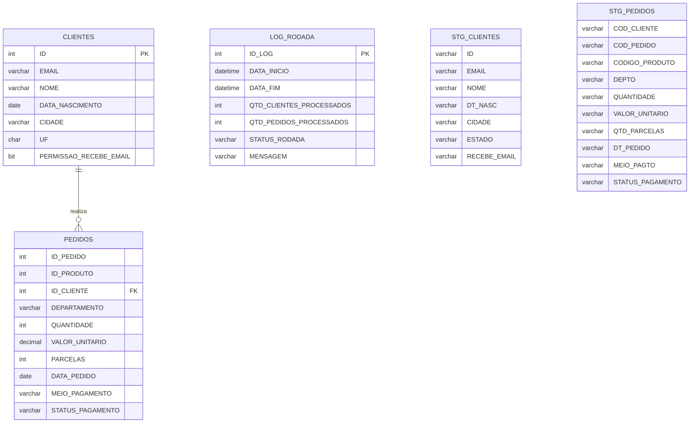

# Projeto de Integração e Consolidação de Dados - PMWEB

## Objetivo

Este projeto implementa um processo de ETL (Extract, Transform and Load) utilizando SQL Server para integração de dados de clientes e pedidos a partir de arquivos CSV, realizando tratamento, padronização, carga para tabelas de produção e geração de análises de negócio.

---

# Arquitetura da Solução

O fluxo de processamento segue as etapas abaixo:

1. Criação da base de dados e estruturas de staging.
2. Importação dos arquivos CSV para tabelas temporárias.
3. Execução da procedure de integração.
4. Tratamento e validação dos dados.
5. Carga nas tabelas finais.
6. Registro da execução em log.
7. Execução das consultas analíticas.

---

# Modelo de Dados (DER)



---

# Estrutura dos Arquivos

| Arquivo                       | Descrição                                                      |
| ----------------------------- | -------------------------------------------------------------- |
| `01_ddl_e_staging.sql`        | Criação do banco de dados e tabelas de produção, staging e log |
| `02_procedure_integracao.sql` | Procedure responsável pelo processo de integração e carga      |
| `03_bulk_insert.sql`          | Importação dos arquivos CSV para staging                       |
| `04_consolidacoes_item4.sql`  | Consultas analíticas e indicadores de negócio                  |

---

# Estrutura das Tabelas

## CLIENTES

Tabela principal contendo os dados cadastrais dos clientes.

| Campo                  | Tipo         |
| ---------------------- | ------------ |
| ID                     | INT          |
| EMAIL                  | VARCHAR(255) |
| NOME                   | VARCHAR(255) |
| DATA_NASCIMENTO        | DATE         |
| CIDADE                 | VARCHAR(100) |
| UF                     | CHAR(2)      |
| PERMISSAO_RECEBE_EMAIL | BIT          |

---

## PEDIDOS

Tabela contendo os pedidos realizados pelos clientes.

| Campo            | Tipo          |
| ---------------- | ------------- |
| ID_CLIENTE       | INT           |
| ID_PEDIDO        | INT           |
| ID_PRODUTO       | INT           |
| DEPARTAMENTO     | VARCHAR(100)  |
| QUANTIDADE       | INT           |
| VALOR_UNITARIO   | DECIMAL(10,2) |
| PARCELAS         | INT           |
| DATA_PEDIDO      | DATE          |
| MEIO_PAGAMENTO   | VARCHAR(50)   |
| STATUS_PAGAMENTO | VARCHAR(50)   |

---

## LOG_RODADA

Tabela responsável pelo monitoramento das execuções do ETL.

| Campo                    | Tipo         |
| ------------------------ | ------------ |
| ID_LOG                   | INT          |
| DATA_INICIO              | DATETIME     |
| DATA_FIM                 | DATETIME     |
| QTD_CLIENTES_PROCESSADOS | INT          |
| QTD_PEDIDOS_PROCESSADOS  | INT          |
| STATUS_RODADA            | VARCHAR(50)  |
| MENSAGEM                 | VARCHAR(MAX) |

---

# Processo de Carga

## 1. Importação dos Arquivos

Os arquivos CSV são carregados para as tabelas de staging utilizando BULK INSERT.

```sql
BULK INSERT STG_CLIENTES
FROM 'C:\Integracao\CADASTROS.csv';

BULK INSERT STG_PEDIDOS
FROM 'C:\Integracao\PEDIDOS.csv';
```

---

## 2. Tratamento dos Dados

A procedure `SP_INTEGRACAO_DADOS` realiza:

### Clientes

* Remoção de espaços em branco.
* Conversão de tipos.
* Conversão de datas.
* Padronização de UF.
* Atualização de registros existentes.
* Inclusão de novos registros.

Utilizando comando:

```sql
MERGE CLIENTES
```

---

### Pedidos

* Conversão de campos numéricos.
* Conversão de datas.
* Tratamento de valores monetários.
* Validação de registros vazios.
* Inclusão dos pedidos na tabela final.

---

### Controle Transacional

A carga é executada dentro de uma transação:

```sql
BEGIN TRANSACTION
...
COMMIT TRANSACTION
```

Em caso de erro:

```sql
ROLLBACK TRANSACTION
```

---

### Logging

Todas as execuções são registradas na tabela `LOG_RODADA`, contendo:

* Data de início
* Data de fim
* Quantidade de registros processados
* Status da execução
* Mensagem de erro (quando aplicável)

---

# Consultas Analíticas Implementadas

## 1. Quantidade de Pedidos Parcelados por Cliente

Calcula a quantidade de pedidos parcelados por cliente, agrupados por semestre e ano.

**Regras:**

* Considera apenas pedidos com mais de uma parcela.
* Desconsidera pedidos cancelados.

---

## 2. Ticket Médio por Cliente

Calcula o valor médio gasto por pedido.

**Agrupamento:**

* Cliente
* Ano
* Mês

---

## 3. Intervalo Médio Entre Compras

Calcula o tempo médio entre compras sucessivas de cada cliente.

**Métrica:**

* Diferença em dias entre pedidos consecutivos.

---

## 4. Classificação de Clientes por Tier

Classifica os clientes conforme o valor total gasto mensalmente.

| Tier   | Faixa de Valor    |
| ------ | ----------------- |
| Básico | Até R$ 1.000      |
| Prata  | Até R$ 2.000      |
| Ouro   | Até R$ 5.000      |
| Super  | Acima de R$ 5.000 |

---

## 5. Comparativo de Vendas 2019 x 2020

Analisa a variação percentual das vendas dos departamentos:

* Som
* Papelaria

Desconsiderando pedidos cancelados.

Resultado:

```text
Departamento
Total 2019
Total 2020
Variação Percentual
```

---

# Respostas Teóricas (Item 2.a)

## 1. Análise de Receita Total por Cliente (Lifetime Value - LTV)

### Descrição

Calcular o valor total gasto por cada cliente ao longo de todo o histórico de compras.

### Resultado Esperado

* Identificação dos clientes mais rentáveis.
* Criação de programas de fidelidade.
* Segmentação para retenção e relacionamento.

---

## 2. Análise de Desempenho de Departamentos por Região

### Descrição

Cruzar os departamentos dos produtos com a UF dos clientes para identificar padrões de consumo regionais.

### Resultado Esperado

* Identificação de oportunidades regionais.
* Otimização logística.
* Campanhas segmentadas por estado.

---

## 3. Análise de Clientes Inativos para E-mail Marketing

### Descrição

Selecionar clientes que autorizam o recebimento de e-mails, mas estão sem comprar há determinado período.

### Resultado Esperado

* Criação de campanhas de reengajamento.
* Aumento da taxa de conversão.
* Redução do custo de aquisição de clientes.

---

# Como Executar

### Passo 1

Executar:

```sql
01_ddl_e_staging.sql
```

### Passo 2

Disponibilizar os arquivos:

```text
C:\Integracao\CADASTROS.csv
C:\Integracao\PEDIDOS.csv
```

### Passo 3

Executar:

```sql
03_bulk_insert.sql
```

### Passo 4

Executar:

```sql
EXEC SP_INTEGRACAO_DADOS;
```

### Passo 5

Executar:

```sql
04_consolidacoes_item4.sql
```

para validar os indicadores analíticos.

---

# Tecnologias Utilizadas

* SQL Server
* T-SQL
* BULK INSERT
* MERGE
* CTE (Common Table Expressions)
* Window Functions (LAG)
* Controle Transacional
* Logging de Processamento

---

# Considerações

A solução foi desenvolvida seguindo boas práticas de ETL, contemplando:

* Camada de staging.
* Tratamento de dados.
* Controle transacional.
* Monitoramento via logs.
* Reprocessamento seguro.
* Consultas analíticas para suporte à tomada de decisão.
