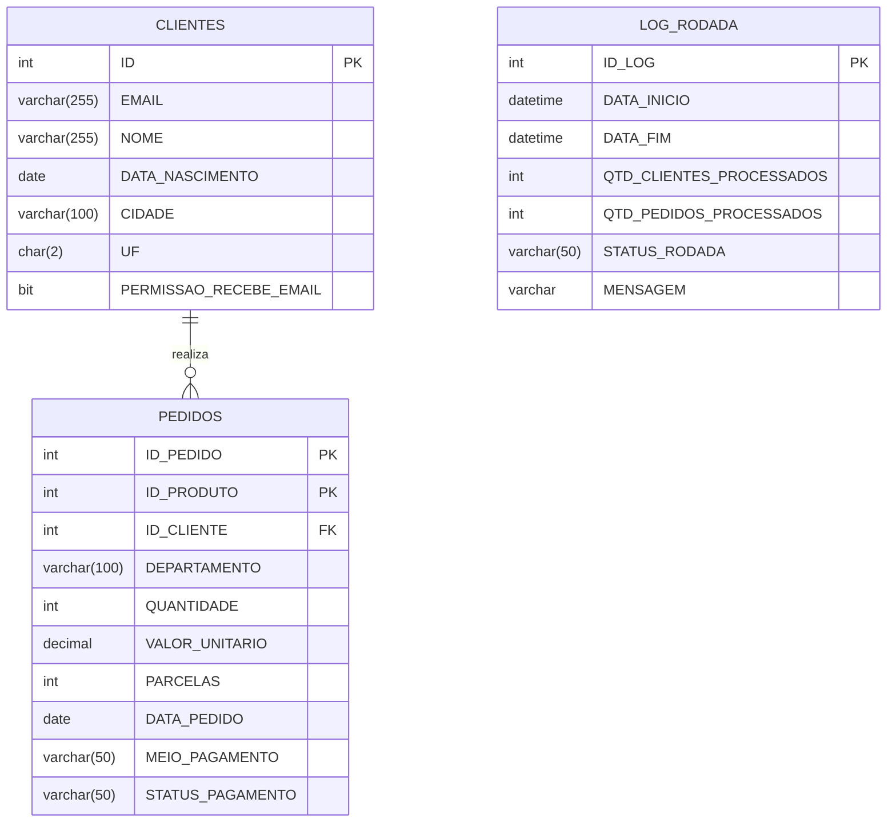

# teste-pmweb

```mermaid
erDiagram
    CLIENTES ||--o{ PEDIDOS : "realiza"
    
    CLIENTES {
        int ID PK
        varchar(255) EMAIL
        varchar(255) NOME
        date DATA_NASCIMENTO
        varchar(100) CIDADE
        char(2) UF
        bit PERMISSAO_RECEBE_EMAIL
    }
    
    PEDIDOS {
        int ID_PEDIDO PK
        int ID_PRODUTO PK
        int ID_CLIENTE FK
        varchar(100) DEPARTAMENTO
        int QUANTIDADE
        decimal VALOR_UNITARIO
        int PARCELAS
        date DATA_PEDIDO
        varchar(50) MEIO_PAGAMENTO
        varchar(50) STATUS_PAGAMENTO
    }
    
    LOG_RODADA {
        int ID_LOG PK
        datetime DATA_INICIO
        datetime DATA_FIM
        int QTD_CLIENTES_PROCESSADOS
        int QTD_PEDIDOS_PROCESSADOS
        varchar(50) STATUS_RODADA
        varchar MENSAGEM
    }

```