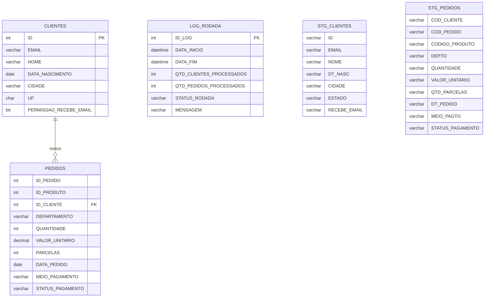

# Projeto de Integração, Consolidação e Arquitetura de Dados - PMWEB

## Objetivo

Este projeto implementa uma solução completa de dados, contemplando desde processos de **ETL (Extract, Transform and Load)** em SQL Server até estratégias avançadas de **Arquitetura de Dados, Governança, Observabilidade e Processamento em Tempo Real (Event-Driven)**.

O repositório representa a entrega da **Avaliação Técnica - Data Services**, dividida em duas frentes complementares:

* **Parte 1:** Engenharia de Dados e Analytics
* **Parte 2:** Arquitetura Escalável, Governança e Estratégia de Dados

---

# Parte 1 - Engenharia de Dados e Analytics

## Arquitetura da Solução

O fluxo de processamento segue as etapas abaixo:

```text
CSV Files
    │
    ▼
Staging Tables
    │
    ▼
SP_INTEGRACAO_DADOS
    │
    ▼
Tabelas de Produção
    │
    ▼
Logs e Auditoria
    │
    ▼
Consultas Analíticas
```

### Etapas do Processo

1. Criação da base de dados e tabelas de staging.
2. Importação dos arquivos CSV.
3. Tratamento e padronização dos dados.
4. Carga incremental utilizando `MERGE`.
5. Registro de logs e auditoria.
6. Disponibilização dos dados para análises.

---

## Modelo de Dados (DER)



---

## Estrutura dos Arquivos

| Arquivo                       | Descrição                                                      |
| ----------------------------- | -------------------------------------------------------------- |
| `01_ddl_e_staging.sql`        | Criação do banco de dados, tabelas de produção, staging e logs |
| `02_procedure_integracao.sql` | Procedure responsável pela integração e carga dos dados        |
| `03_bulk_insert.sql`          | Importação dos arquivos CSV para staging                       |
| `04_consolidacoes_item4.sql`  | Consultas analíticas e indicadores de negócio                  |

---

## Processo ETL

### 1. Importação

Os arquivos CSV são carregados para as tabelas:

* `STG_CLIENTES`
* `STG_PEDIDOS`

através de comandos **BULK INSERT**.

### 2. Transformação e Tratamento

A procedure `SP_INTEGRACAO_DADOS` executa:

* Remoção de espaços em branco;
* Conversão de tipos de dados;
* Padronização de estados (UF);
* Conversão de datas e valores monetários;
* Validação de registros inválidos;
* Controle transacional com `COMMIT` e `ROLLBACK`.

### 3. Carga

Utilização de instruções `MERGE` para:

* Inserção de novos registros;
* Atualização de registros existentes.

### 4. Auditoria

Cada execução registra:

* Data e hora de início;
* Data e hora de término;
* Quantidade de registros processados;
* Status da execução;
* Mensagens de erro ou sucesso.

---

## Consultas Analíticas Implementadas

### Pedidos Parcelados por Cliente

* Agrupamento por semestre e ano;
* Exclusão de pedidos cancelados.

### Ticket Médio por Cliente

* Agrupamento mensal;
* Evolução temporal do consumo.

### Intervalo Médio Entre Compras

Utilização da função:

```sql
LAG()
```

para calcular o tempo médio entre pedidos.

### Tiers de Clientes

Classificação baseada no gasto mensal:

| Tier   | Faixa                |
| ------ | -------------------- |
| Básico | Menor volume         |
| Prata  | Volume intermediário |
| Ouro   | Alto volume          |
| Super  | Clientes premium     |

### Comparativo YoY (2019 x 2020)

Análise da variação percentual de vendas por departamento.

---

# Parte 2 - Arquitetura, Engenharia Escalável e Estratégia de Dados

## Engenharia de Dados & Observabilidade

**Arquivo:** `01_eng_dados_observ.sql`

### Data Lineage e Auditoria

Implementação da tabela:

```sql
ETL_AUDIT_LOG
```

Registrando:

* Trace ID único;
* Tempo por etapa;
* Volumetria de entrada e saída;
* Status das execuções.

### Resiliência e Fault Tolerance

Implementação de:

```sql
ETL_CHECKPOINT
```

Permitindo retomada automática do processamento após falhas.

### Sanitização Avançada

Inclui:

* Proper Case para nomes;
* Validação de e-mails;
* Tratamento inteligente de nulos;
* Regras de qualidade de dados.

---

## Inteligência Aplicada (SQL & Analytics)

**Arquivo:** `02_kpis_avancados.sql`

### Next Best Action (NBA)

Recomendação de produtos baseada em:

* Departamento favorito do cliente;
* Produtos de maior giro da categoria.

### Lifetime Value (LTV)

Cálculo do valor histórico gerado pelo cliente utilizando:

```sql
NTILE(10)
```

para segmentação em decis.

### Detecção de Anomalias

Uso de Z-Score para identificar:

* Pedidos com valores atípicos;
* Possíveis inconsistências ou fraudes.

---

## Arquitetura & Governança

## SCD Tipo 4 (Histórico de Crédito com Mini-Dimension)

Para evitar o crescimento excessivo da dimensão de clientes causado por atributos altamente voláteis, como Score, Status de Crédito e Classificação de Risco, foi adotada uma estratégia de SCD Tipo 4 (Mini-Dimension).

Dim_Cliente: mantém apenas atributos estáveis (Nome, CPF, Data de Nascimento, Gênero), possuindo uma única linha por cliente.

Dim_Perfil_Credito: mini-dimensão responsável por armazenar combinações de perfis de crédito, como Faixa de Score, Status e Nível de Risco, reduzindo a necessidade de versionamento constante da dimensão principal.

Fato_Pedidos: registra tanto a SK_Cliente quanto a SK_Perfil_Credito vigente no momento da transação, preservando o contexto histórico sem alterar registros anteriores.

Fato_Historico_Credito (Opcional): tabela factless utilizada para rastrear períodos de permanência em cada perfil de crédito, permitindo análises temporais e auditoria completa das mudanças.

Benefícios: menor crescimento da dimensão principal, melhor performance em consultas analíticas, redução de armazenamento e preservação eficiente do histórico de crédito.
---

## Performance para Ambientes com 100M+ Registros

Estratégias adotadas:

### Clustered Columnstore Index

Otimização para cargas analíticas massivas.

### Particionamento

Partições por data para:

* Redução de I/O;
* Melhor paralelismo.

### Predicados SARGables

Eliminação de conversões implícitas em filtros.

### Indexed Views

Materialização de agregações críticas para dashboards.

---

## Estratégia CRM (Salesforce / Data Cloud)

### Golden Record

Construção de uma identidade única utilizando:

#### Matching Rules

* Exatas (Exact Match)
* Aproximadas (Fuzzy Match)

#### Survivorship Rules

* Recência
* Prioridade da fonte

Resultado:

```text
Unified Individual ID
```

com rastreabilidade completa dos identificadores de origem.

---

### Proteção de Dados (PII)

Aplicação de:

* Dynamic Data Masking (DDM);
* Hashing Determinístico (SHA-256);
* Controle de acesso por perfil.

Garantindo conformidade e segurança dos dados.

---

## Arquitetura Moderna de Compartilhamento

### Zero-Copy Integration

Substituição de processos tradicionais de ETL por:

* Snowflake Data Sharing;
* Delta Sharing;
* Secure Views;
* Row-Level Security (RLS).

Benefícios:

* Menor custo operacional;
* Dados em tempo real;
* Governança centralizada.

---

## Processamento Event-Driven (< 5 segundos)

Arquitetura reativa baseada em eventos:

```text
Banco de Dados
      │
      ▼
Debezium (CDC)
      │
      ▼
Apache Kafka
      │
      ▼
Apache Flink
      │
      ▼
Webhook / Lambda
      │
      ▼
CRM
```

### Fluxo

1. Novo pedido é gravado no banco.
2. Debezium captura a alteração via CDC.
3. Evento publicado no Kafka.
4. Apache Flink processa e recalcula indicadores.
5. CRM recebe atualização em tempo real.

### Benefícios

Baixa latência (< 5s)

Escalabilidade horizontal

Processamento assíncrono

Integração em tempo real

---

# Tecnologias Utilizadas

* SQL Server
* T-SQL
* BULK INSERT
* MERGE
* Window Functions
* Apache Kafka
* Apache Flink
* Debezium
* Salesforce Data Cloud
* Snowflake
* Delta Sharing

---

# Considerações Finais

Este projeto demonstra uma abordagem completa de engenharia e arquitetura de dados, contemplando:

* Integração e qualidade de dados;
* Observabilidade e auditoria;
* Analytics e KPIs avançados;
* Governança corporativa;
* Arquiteturas modernas orientadas a eventos;
* Estratégias escaláveis para ambientes de grande volume.

O resultado é uma plataforma preparada para suportar cenários analíticos e operacionais de alta complexidade, mantendo rastreabilidade, performance e governança de ponta a ponta.
